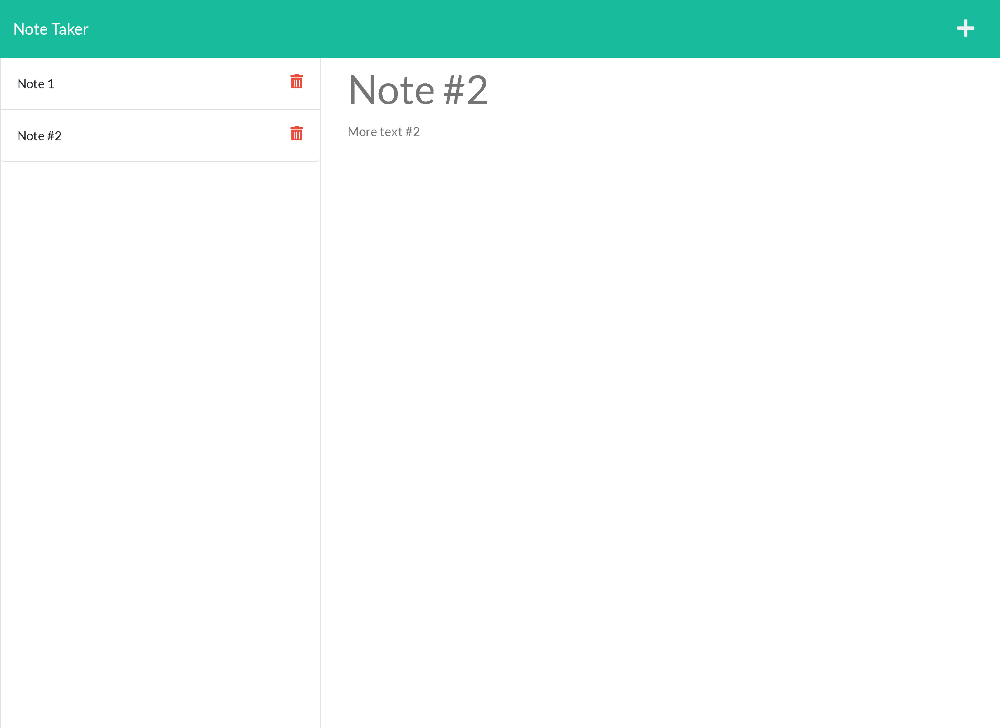

# Note Taker

## Contents
1. [About](#About)
2. [Description](#Description)
3. [Installation](#Installation)
4. [Contact-Info](#Contact-Info)
5. [License](#License)

## About

Presents user an application to write and store memos on a 'to-do' list and save entries to the server. User can check memo description text by clicking on the memo on the left hand side after saving. User may also delete entries by clicking the X button on the left side. Add additional memos by clicking the + symbol in the top right corner

## Description
Application uses express server to give user a space away from local storage to store memos. Upon saving, application assigns unique ID to each memo using uuid version 4. Delete button tracks the unique ID and removes entry from the array of memos by unique ID.

## Installation
Upon cloning repository, be sure to check package.json for needed dependencies (express, path, uuid, and nodemon). use the npm install command to install all needed dependencies. Use command npm start to run to use local server.

## Contact-Info
Alan Gaudet - <alanmgaudet@gmail.com>

Portfolio - <https://github.com/amgaudet>

## License
MIT License

Copyright (c) 2021 Alan Gaudet

Permission is hereby granted, free of charge, to any person obtaining a copy
of this software and associated documentation files (the "Software"), to deal
in the Software without restriction, including without limitation the rights
to use, copy, modify, merge, publish, distribute, sublicense, and/or sell
copies of the Software, and to permit persons to whom the Software is
furnished to do so, subject to the following conditions:

The above copyright notice and this permission notice shall be included in all
copies or substantial portions of the Software.

THE SOFTWARE IS PROVIDED "AS IS", WITHOUT WARRANTY OF ANY KIND, EXPRESS OR
IMPLIED, INCLUDING BUT NOT LIMITED TO THE WARRANTIES OF MERCHANTABILITY,
FITNESS FOR A PARTICULAR PURPOSE AND NONINFRINGEMENT. IN NO EVENT SHALL THE
AUTHORS OR COPYRIGHT HOLDERS BE LIABLE FOR ANY CLAIM, DAMAGES OR OTHER
LIABILITY, WHETHER IN AN ACTION OF CONTRACT, TORT OR OTHERWISE, ARISING FROM,
OUT OF OR IN CONNECTION WITH THE SOFTWARE OR THE USE OR OTHER DEALINGS IN THE
SOFTWARE.
